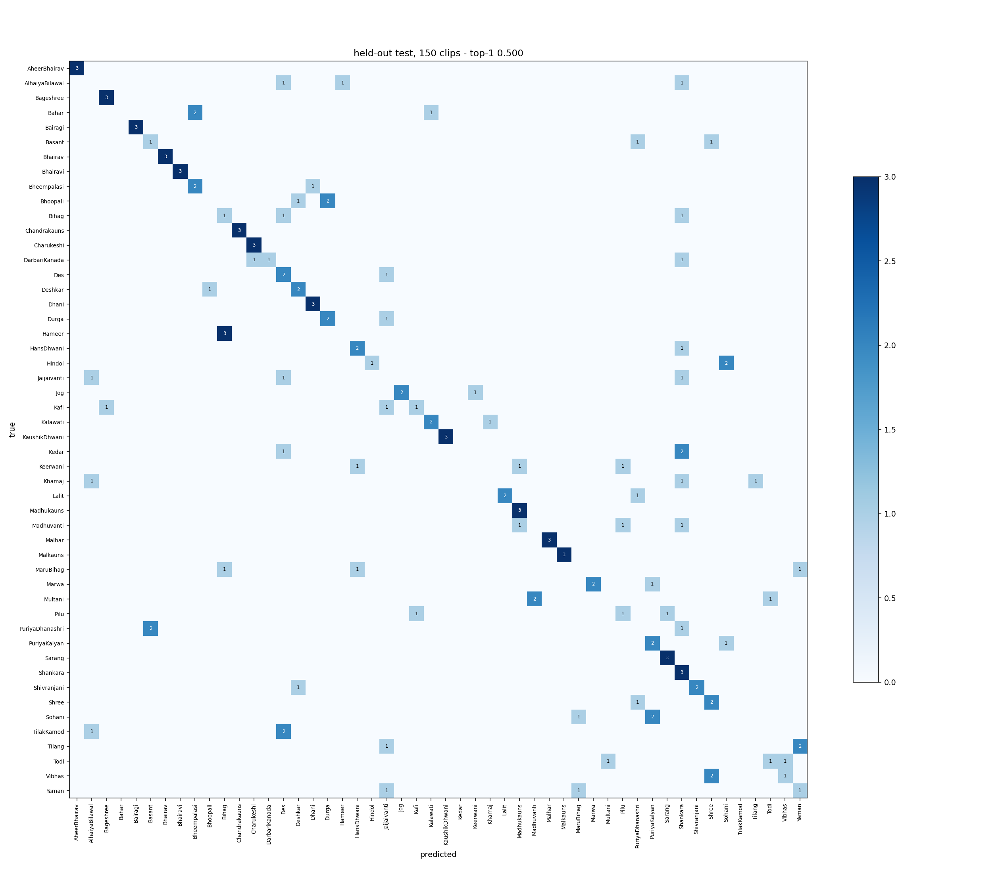

# CQT + pitch-histogram raag classifier

*50 Hindustani raags, from a sung recording and its tonic.*

Give it a sung or hummed recording and the tonic, and it names the five most likely raags
out of 50, with probabilities.

**The tonic is required and it is not a formality.** A raag is a pattern of intervals above
Sa, not a set of frequencies.

## Usage

This is plain PyTorch with a small package next to the weights, not a `transformers` model,
so it is loaded by putting the downloaded repository on `sys.path` rather than through
`AutoModel`.

```bash
pip install torch librosa soundfile essentia huggingface_hub datasets
```

```python
import sys

# Download Model

from huggingface_hub import snapshot_download

repo = snapshot_download("neerajaabhyankar/cqt-histogram-hindustani-raag-small")
sys.path.insert(0, repo)

# Load Model

from raag_fusion import RaagIdentifier

model = RaagIdentifier.load()

# Use the following inputs
#   audio (1d numpy array)
#   sampling_rate (int)
#   tonic_hz (float)

top5 = model.predict(audio, sampling_rate, tonic_hz=tonic_hz)
```

```python
>>> top5
[Prediction(raag='Khamaj', probability=0.430),
 Prediction(raag='Des', probability=0.221),
 Prediction(raag='TilakKamod', probability=0.047),
 Prediction(raag='Pilu', probability=0.042),
 Prediction(raag='AlhaiyaBilawal', probability=0.041)]
```

To test on a saved audio, you may supply the tonic any of these ways:

```python
from raag_fusion import audio, tonic_from_hum

model.predict_file("alap.wav", tonic_hz=146.83)                  # you know Sa

y, sr = audio.load("my_sa.wav")                                  # 5 s of a held Sa
model.predict_file("alap.wav", tonic_hz=tonic_from_hum(y, sr))

y, sr = audio.load("alap.wav")                                   # arrays, if you prefer
model.predict(y, sr, tonic_hz=146.83, top_k=10)
```

or straight from the shell

```bash
python predict.py alap.wav --tonic-note D3      # or --tonic-hz / --tonic-file
```

To test on live audio, see `quickstart.py`. Hum a steady Sa for five seconds (prompts you to do this),
or pass the frequency or note like `--tonic-note D3` or  `--tonic-note 440.0`.

```bash
python quickstart.py                            # hum into your microphone
```

Probabilities for all 50 raags, in `weights/raags.json` order, come from
`model.probabilities(y, sr, tonic_hz)`. Recordings longer than 20 s are cut into 20 s
windows and averaged, so pass the whole thing rather than a slice.

## Accuracy

On 150 held-out clips, **the right raag is the top guess 50 % of the time and somewhere in
the five 87 % of the time.** Chance is 2 % and 10 %.

| | top-1 | top-5 |
|---|---|---|
| **this model** (all 1810 training clips), scored through `predict` | **0.500** | **0.867** |
| the same recipe fit on 80 %, validated on the other 20 % | 0.433 | 0.800 |
| — its CQT branch alone | 0.400 | 0.713 |
| — its melody branch alone | 0.307 | 0.733 |
| chance | 0.020 | 0.100 |

**Every** row is now measured the way you would use the model: `predict` on the raw audio,
every 20 s window averaged. Earlier versions of this card scored the lower rows on only the
middle 20 s of each clip — what a *training* example is — so those rows are not directly
comparable with the ones published before this revision. The branch rows come from a single
pass in which the decode, the CQT and the pitch track are computed once and shared, so the
three branches are scored on byte-identical features.

The 150 test clips come from 50 recordings that appear nowhere in training, so nothing here
is recording recall. On 150 clips the standard error of a top-1 figure is about 4 points,
and re-dealing the train/validation split moves this method's test score over a range of
about 9 points. **Read the headline as "roughly one in two", not as 0.500.**

### On the pitch tracker, and why the melody row went down

This model used CREPE until 2026-09-19 and now uses Essentia's Melodia. The switch was made
for speed — 57x real time against CREPE-tiny's 4x, both on CPU, and no GPU wanted — and the
accuracy evidence is genuinely split, so it is reported rather than summarised:

| | validation (460 clips) | test (150 clips) |
|---|---|---|
| melody branch, CREPE | 0.430 | 0.347 |
| melody branch, Melodia | **0.491** | 0.307 |

**The tracker that wins on validation loses on test, and the test split cannot resolve it.**
Validation is the comparison with power here: it is 460 clips against 150, the melody branch
fits nothing on it, and the same +0.06 gap appeared in every seed of a separate three-seed
survey. The 150 test clips are 50 recordings measured once, where 4 points is one standard
error. The fused model came out ahead on both counts (0.480 -> 0.500 test, and +0.047 top-5),
but +0.020 on 150 clips is inside the noise and should not be read as the tracker being
worth two points.

What is not in doubt is the cost: the feature cache for all 1960 clips dropped from about 45
minutes to 18, and the tracker is now deterministic — CREPE dithered from numpy's global RNG
and had to be seeded to give the same answer twice.

**The mistakes are musical.** When it is wrong, the raag it names is much closer to the true
one than a random raag would be: mistake affinity **0.49** against a chance floor of 0.27,
measured on the released model itself. Most
errors are inside a family — e.g., the Kafi-thaat cluster, the Bhairav cluster, etc. — rather than
arbitrary.



## How it works

Two models that fail in different places, averaged.

**Branch 1 — a small 2-D ResNet over a Sa-anchored CQT.** The constant-Q transform's `fmin`
is set to the recording's own Sa, so bin 0 *is* Sa and the frequency-to-swar mapping is
identical for every recording ever recorded. Tonic invariance is structural: nothing is
resampled and nothing is learned. The trunk pools time hard and frequency gently, because
the frequency axis is the label. The head does not classify with 50 free weight vectors; it
predicts one 12-bin swar profile and scores it against 50 per-raag templates by chi-square,
with the templates initialised from the [Tanarang](http://tanarang.com) database via the
[libmogra](https://pypi.org/project/libmogra/) library, so a raag with 18 training clips
starts from something usable. 554 k parameters.

**Branch 2 — a pitch histogram and a logistic regression.** Essentia Melodia's f0 track,
expressed in cents above Sa, folded into one octave, 120 bins, blurred slightly and
compressed by a square root. No note segmentation, no phrase model, no grammar — and it
lands within a few points of an elaborate symbolic pipeline built on note n-grams and a
12-way tonic search, which is why the naive version is the one that ships.

The track itself lives in `raag_fusion.pitch`, apart from the classifier, because it is
tonic-free and everything that reads melody out of a recording wants it — this branch, a
swar histogram drawn for a listener, anything built on top of one. `melody_branch.histogram`
turns a track into a distribution over pitch classes that sums to 1 and can be drawn as
"share of your time"; `melody_branch.features` is the square-root compression that makes it
the classifier's input. Keeping those apart matters: the compressed array is a feature
vector, and drawing it as time would misreport every proportion by a square root.

**The fusion.** Each branch's scores become probabilities through a softmax whose
temperature was fitted on the validation split; the two are then mixed with a weight (0.55
on the histogram) also chosen on validation. That weight was 0.40 under CREPE: the melody
branch overtook the CQT branch on validation when the tracker changed (0.491 against 0.443),
and the calibration sweep moved the mix toward it without being told to. Recordings longer than 20 s are cut into 20 s
windows — the length of every training clip — and the per-window probabilities averaged.

Why averaging rather than one joint model: the two branches agree on only 31 % of test
clips while the CQT branch is right on 47 % and the melody branch on 37 %, so between them
they hold the right answer for 61 %. Averaging captures 82 % of that pool and lands at
0.500. Concatenating the histogram onto the network's features as an extra input and
training the two together captures 54 % and lands at 0.364 — the network leans on the easy
feature and stops improving the trunk. (That last comparison was measured under CREPE and
has not been repeated since; the agreement figures above are from the released Melodia
model.) The cheap combination won, and it was measured, not assumed.

## What it is for, and what it is not for

Made for: exploring a recording you cannot place, and as a baseline for raag
classification research on this dataset.

It will disappoint you if you expect:

* **Any of the other ~500 raags.** It will output its best guess on the 50 raags it
knows. There is no "not a raag" output.
* **Ensemble recordings.** Training audio is solo vocal/instrumental with tanpura/tabla accompaniments.
* **Short fragments.** Under about 20 seconds there is not enough pitch material; the model
  will still answer, and the answer will be worse.
* **An authoritative verdict.** Top-1 is wrong half the time. It is a shortlist.

Two more noteworthy limits: the training corpus is 1810 clips over 50 raags with between 18 and
73 clips each, so the thin classes are weaker; and every clip comes from concert or studio
recordings, so raw phone audio is out of distribution.

## Training data

[`neerajaabhyankar/hindustani-raag-small`](https://huggingface.co/datasets/neerajaabhyankar/hindustani-raag-small),
pinned at revision **`326caef0bc01da44ad46e4d9c65a5146da6bcc5b`** (v1.1): 1960 solo-vocal
clips over 50 raags, each with a hand-annotated tonic, split into 1810 for training and 150
for test along *recording* boundaries.

**Use that revision.** The v1 audio lives only in the repo's parquet files; the
`<Raag>/*.mp3` tree at its root is an older version, and a loader that walks the raw layout
silently trains on the wrong corpus. `train.py` reads the parquet through
`datasets.load_dataset` at the pinned commit, so it cannot make that mistake. The commit is
also recorded in `weights/config.json`, so a downloaded checkpoint says what it was fitted
on without reference to this file.

The 50 raags are listed in `weights/raags.json`; class sizes run from 18 to 73 clips.

## Reproducing

```bash
pip install -r requirements.txt datasets scikit-learn libmogra rapidfuzz
python train.py                             # the released weights: every training clip, 34 epochs
python train.py --val-fraction 0.2 --test   # hold a fifth of the videos out and report
```

Seeded end to end. About 18 minutes to cache features for the 1960 clips and 38 minutes to
train on a 16 GB Mac (mps). The cache build used to take about 45 minutes, dominated by
CREPE; Melodia is CPU-only and roughly 14x faster, so mp3 decode and the CQT now dominate
instead. `--device mps` / `--device cuda` still helps the CQT half.
`train.py --help` explains each choice in the recipe, including why the epoch count is fixed
rather than early-stopped for the released model.

## Files

| | |
|---|---|
| `raag_fusion/` | the model: `pitch` (Essentia Melodia), `cqt_branch`, `melody_branch`, `identifier` (fusion), `tonic` |
| `weights/` | `cqt_net.pt`, `melody_linear.npz`, `raags.json`, `config.json` |
| `train.py` | reproduce the weights from the pinned dataset |
| `predict.py`, `quickstart.py` | a file, or your microphone |
| `tests/` | `test_pitch.py` (the pitch pathway, no weights or dataset needed), `test_model.py` (accuracy against the numbers below) |
| `upload_to_hub.py` | push this directory to the Hub |

## Provenance

This configuration is the outcome of a survey of deep-learning approaches to the task
(August–September 2026) performed with the help of Claude. Source code lives [here](https://github.com/neerajaabhyankar/libmogra-sandbox/commit/372c942ab5ba03cc766ccc08f1f4bf12a2820ad8).
Among other methods tried: distilHuBERT fine-tuning (0.053 test), a 1-D waveform ResNet (0.227),
FiLM tonic conditioning (worse than no tonic at all), HPSS source separation (no gain), 
graded label smoothing from the raag database, and a learned-template head.
The tonic representation and this two-branch fusion were the only two changes that
moved the number by more than the noise.

## License

This repository uses separate licenses for its components:

- **Source code:** Apache License 2.0
- **Trained model artifacts:** CC BY-NC-SA 4.0

The model was trained on
[`neerajaabhyankar/hindustani-raag-small`](https://huggingface.co/datasets/neerajaabhyankar/hindustani-raag-small),
which contains third-party audio not licensed by the dataset curator.

The model license does **not** grant any rights in the recordings used to train it.
See [LICENSE](./LICENSE) for full terms and training-data provenance.
